# ENSF-607 Assignment 1

An assignment on developing a command line Course Registration System.

## Folder Structure

- [Assignment_1.pdf](Assignment_1.pdf): assignment document
- [src](src): source code
- [lib](lib): setup data and jar of library used
- [screenshots](screenshots): screenshots of the program
- [Run.sh](Run.sh): executable for unix based OS
- [Run.cmd](Run.cmd): executable for Windows

## Program design and flow

- As soon as the program is launched, it reads the [resource files](#details-of-resource-files) to create course catalog, and registers all the dummy students

- You as a student would enter your details to enter the system

- Before registering a course (program menu option number 2), the pre-requisites of the course are checked. You must be registered for the pre-requisite courses to register for any course.

- After registration, a warning is showed only if there are less than 8 students registered in the selected offering

- All the course details, offering details, and occupancy details can be printed using program menu option number 4.

- Refer to the [screenshots](#screenshots) to get an idea of the working of the program

## Details of resource files

- Data required for Course Catalog is stored in [lib/course_catalog.txt](lib/course_catalog.txt). Format of data is:

  ```
  <course name>, <comma separated list of pre-requisite courses>
  ```

- Data required for Course Offering is stored in [lib/course_offerings.txt](lib/course_offerings.txt). Format of data is:

  ```
  <course name>, <offering section number>, <offering maximum capacity>
  ```

- Dummy students and their registration informations is stored in [lib/dummy_students.txt](lib/dummy_students.txt). Format of data is:

  ```
  <student name>, <student ID number>, <comma separated list of registered offering in the format <courseName-courseNumber-offeringSection>>
  ```

## How to build and run

1. JDK version 1.7 or above is required to build and run this program.

2. Clone the repository on your machine, or download the zip file

3. Run the [Run.sh](Run.sh) or [Run.cmd](Run.cmd) file to run the program

4. Then follow the onscreen instructions

## Screenshots

Student entering his/her details

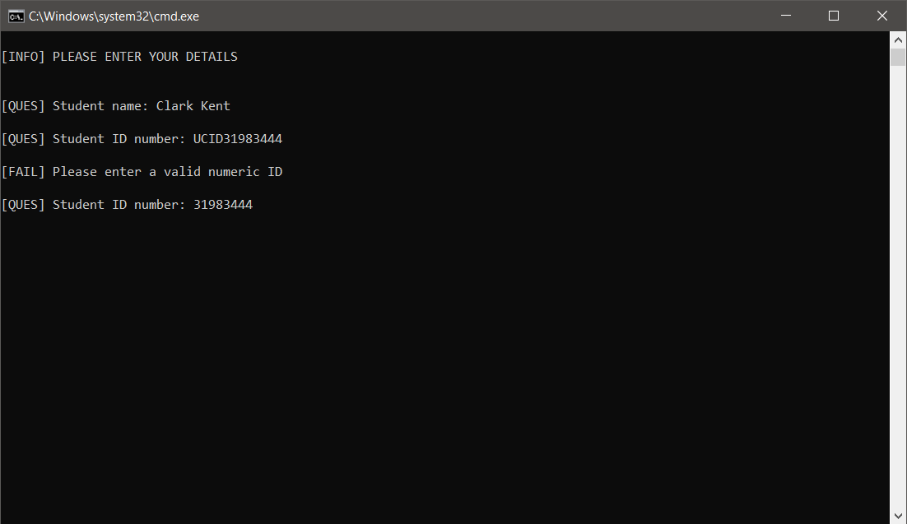

Program menu options

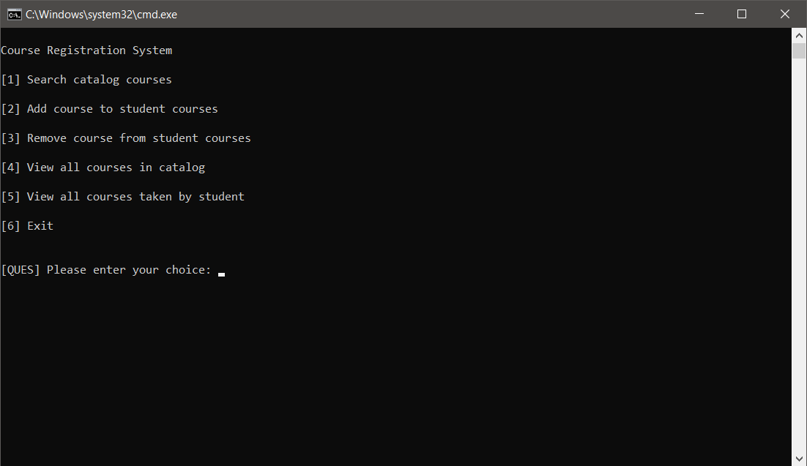

Menu option 1: no search results

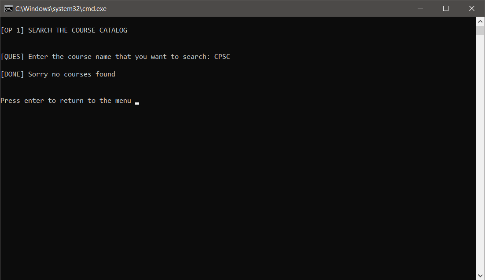

Menu option 1: search produced some results

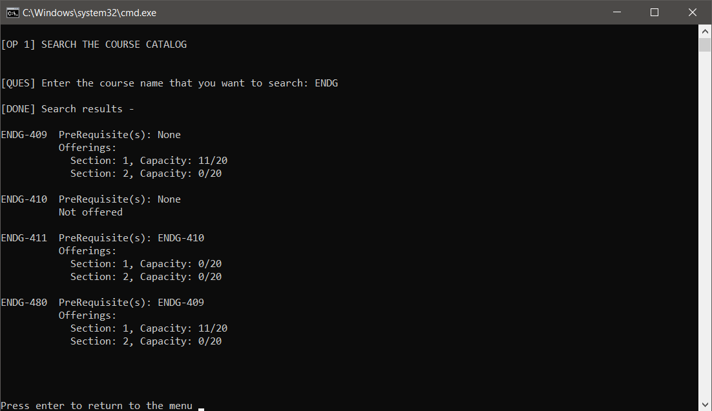

Menu option 2: couldn't register as all registrations are full in this offering

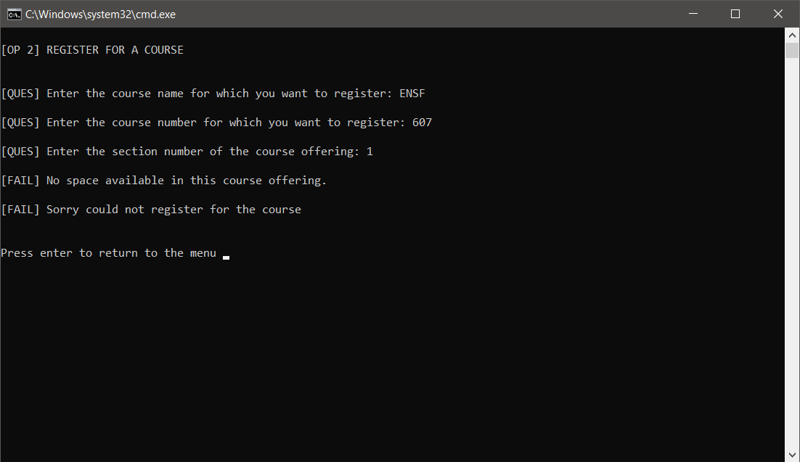

Menu option 2: couldn't register as pre-requisites are not met

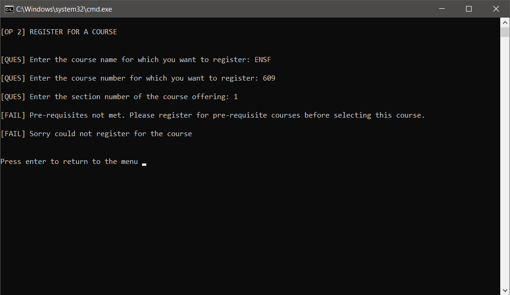

Menu option 2: successfully registered

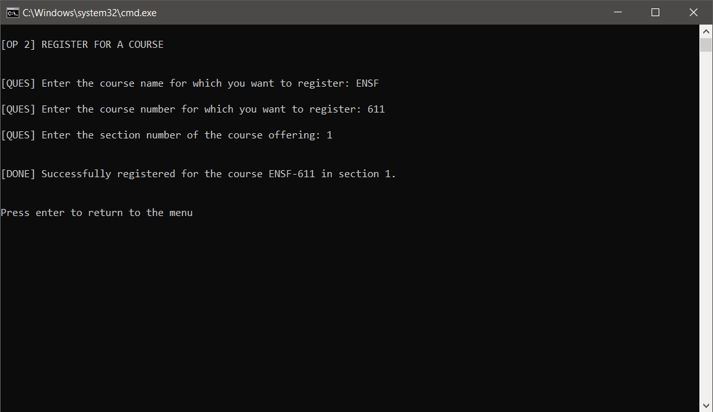

Menu option 2: successfully registered but a warning is issued

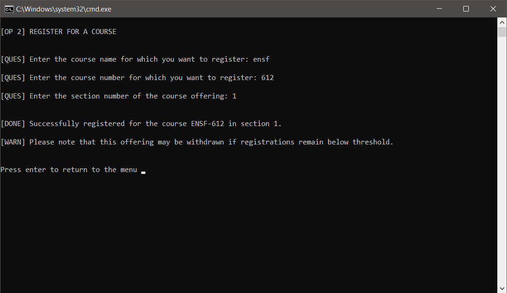

Menu option 2: cannot register for more than 6 courses

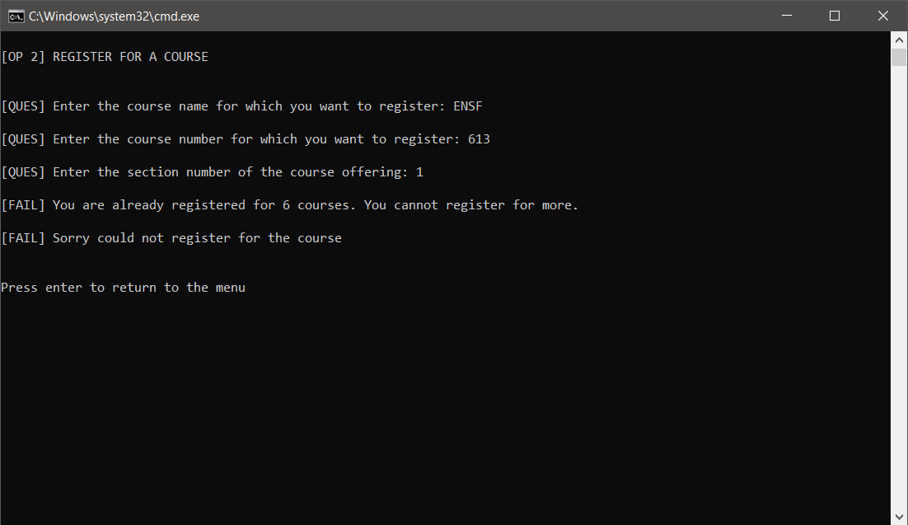

Menu option 3: cannot de-register as registered courses has depedency


Menu option 3: successfully de-registered

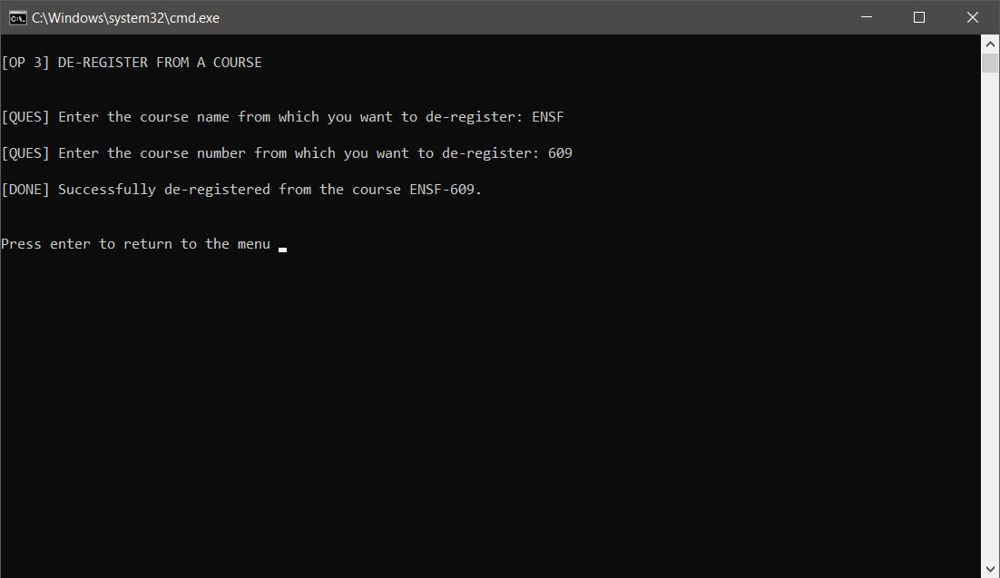

Menu option 4: view the entire course catalog

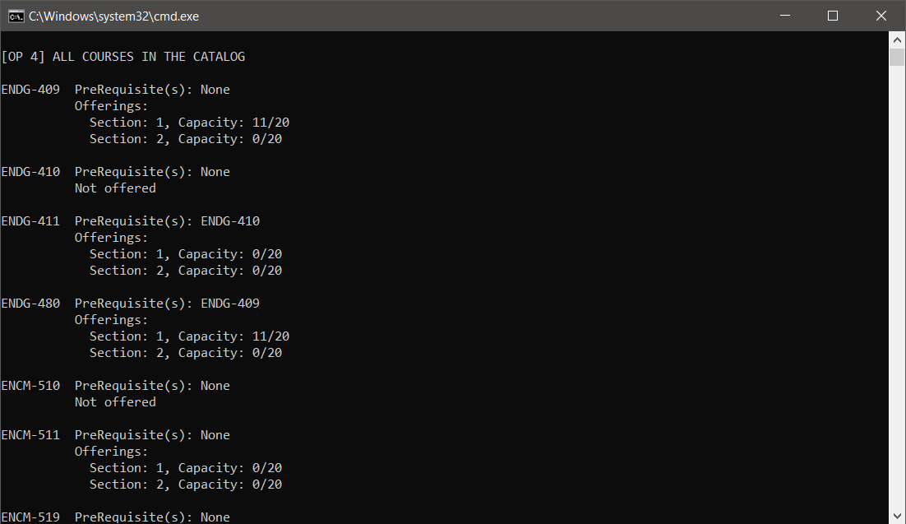

Menu option 5: show all the registered courses for the current student

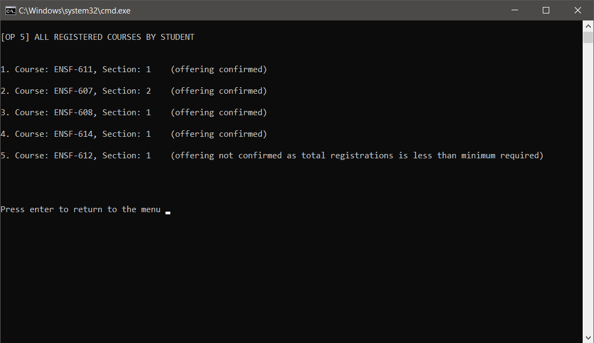

Menu option 6: exit the program

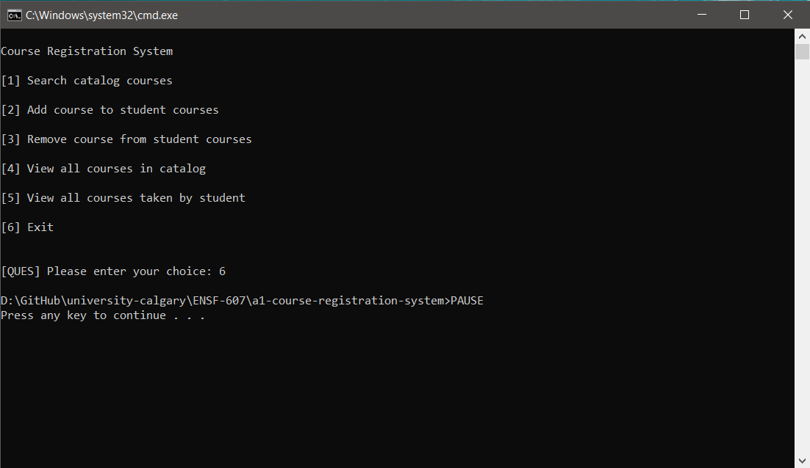
