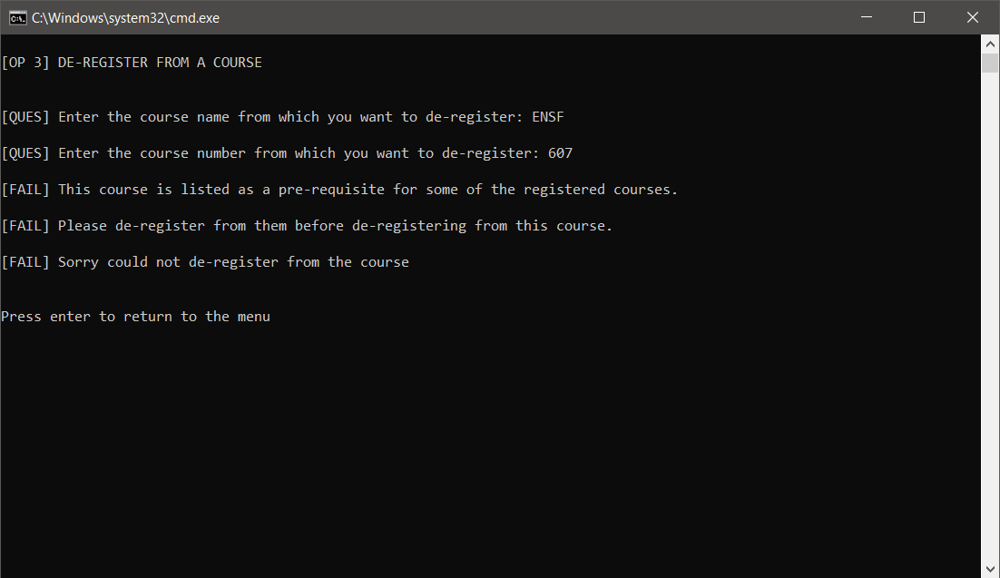

# Course Registration System

## About

A course registration system based on the specifications laid in [Assignment_1.pdf](Assignment_1.pdf)


## Dependencies

+ JDK 1.7 or above configured


## Program design and flow 

+ As soon as the program is launched, it reads the [resource files](#details-of-resource-files) to create course catalog, and registers all the dummy students

+ You as a student would enter your details to enter the system

+ Before registering a course (program menu option number 2), the pre-requisites of the course are checked. You must be registered for the pre-requisite courses to register for any course.

+ After registration, a warning is showed only if there are less than 8 students registered in the selected offering

+ All the course details, offering details, and occupancy details can be printed using program menu option number 4.

+ Refer to the [screenshots](#screenshots) to get an idea of the working of the program


## Details of resource files

+ Data required for Course Catalog is stored in [lib/course_catalog.txt](lib/course_catalog.txt)

   + Each line in the file follows the below format
     ```
     <course name>, <comma separated list of pre-requisite courses>
     ```

+ Data required for Course Offering is stored in [lib/course_offerings.txt](lib/course_offerings.txt)

   + Each line in the file follows the below format
     ```
     <course name>, <offering section number>, <offering maximum capacity>
     ```

+ Dummy students and their registration informations is stored in [lib/dummy_students.txt](lib/dummy_students.txt)

   + Each line in the file follows the below format
   ```
   <student name>, <student ID number>, <comma separated list of registered offering in the format <courseName-courseNumber-offeringSection>>
   ```


## Running the program

1. Extract the downloaded the zip archive or clone the project on your local machine

2. If using Windows OS

   1. Navigate to the directory where the project is extracted/cloned

   2. Double click on the file `Run.cmd`

   3. Follow the onscreen instructions

3. If not using Windows OS
   
   1. Using the terminal, go to the directory where the project is extracted/cloned

   2. Run the below commands
      ```shell
      chmod +x Run.sh
      ./Run.sh
      ```

   3. Then follow the onscreen instructions


## Screenshots

Student entering his/her details


Program menu options


Menu option 1: no search results


Menu option 1: search produced some results


Menu option 2: couldn't register as all registrations are full in this offering


Menu option 2: couldn't register as pre-requisites are not met


Menu option 2: successfully registered


Menu option 2: successfully registered but a warning is issued


Menu option 2: cannot register for more than 6 courses


Menu option 3: cannot de-register as registered courses has depedency



Menu option 3: successfully de-registered


Menu option 4: view the entire course catalog


Menu option 5: show all the registered courses for the current student


Menu option 6: exit the program


